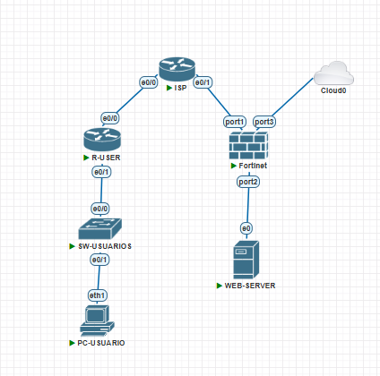
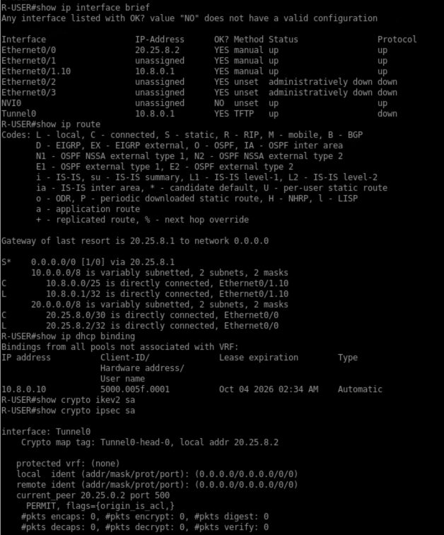
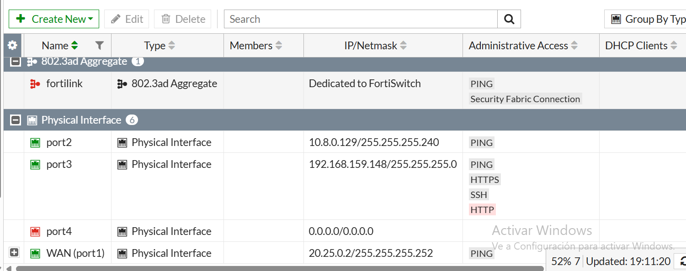

# Infraestructura 3 — VPN Site-to-Site IPsec

**Matrícula:** 2025-0800  
**Entorno:** PNETLab / Cisco IOS / FortiGate / Ubuntu Server

## 1. Objetivo
Implementar una infraestructura con red de usuarios, ISP simulado, VPN Site-to-Site IPsec entre `R-USER` y `FG-Server`, y una red de servidores.

## 2. Topología
```text
PC-Usuario
10.8.0.0/25
    |
    | VLAN 10
    v
+----------------+
|  SW-Usuarios   |
| e0/0 Trunk     |
| e0/1 Access    |
+-------+--------+
        |
        v
+----------------+
|    R-USER      |
| 10.8.0.1/25    |
| 20.25.8.2/30   |
+-------+--------+
        |
        | 20.25.8.0/30
        v
+----------------+
|      ISP       |
| 20.25.8.1/30   |
| 20.25.0.1/30   |
| Loopback 8.8.8.8|
+-------+--------+
        |
        | 20.25.0.0/30
        v
+----------------+
|   FG-Server    |
| 20.25.0.2/30   |
| 10.8.0.129/28  |
+-------+--------+
        |
        v
   WEB SERVER
   10.8.0.130/28

R-USER <========== IPsec ==========> FG-Server
```

## 3. Direccionamiento

| Equipo | Interfaz | Dirección |
|---|---|---|
| PC-Usuario | VLAN 10 | DHCP / `10.8.0.0/25` |
| R-USER | e0/1.10 | `10.8.0.1/25` |
| R-USER | e0/0 | `20.25.8.2/30` |
| ISP | e0/0 | `20.25.8.1/30` |
| ISP | e0/1 | `20.25.0.1/30` |
| ISP | Loopback0 | `8.8.8.8/32` |
| FG-Server | WAN | `20.25.0.2/30` |
| FG-Server | LAN | `10.8.0.129/28` |
| Web Server | LAN | `10.8.0.130/28` |

## 4. Switch SW-Usuarios

`e0/0` es trunk hacia R-USER y permite VLAN 10. `e0/1` es access hacia el PC. Los puertos e0/2 y e0/3 están apagados.

```cisco
show vlan brief
show interfaces trunk
show running-config
```



## 5. R-USER

El router entrega DHCP para `10.8.0.0/25`, utiliza `10.8.0.1` como gateway y tiene una ruta hacia `10.8.0.128/28` mediante `Tunnel0`.

```cisco
show ip interface brief
show ip route
show ip dhcp binding
show crypto ikev2 sa
show crypto ipsec sa
```




## 6. ISP

El ISP simula la red intermedia:

- e0/0: `20.25.8.1/30`
- e0/1: `20.25.0.1/30`
- Loopback0: `8.8.8.8/32`

```cisco
show ip interface brief
show ip route
```

## 7. FortiGate

El FortiGate utiliza `20.25.0.2/30` hacia el ISP y `10.8.0.129/28` hacia la red de servidores. El peer remoto de la VPN es `20.25.8.2`.




## 8. Web Server

El servidor utiliza `10.8.0.130/28` con gateway `10.8.0.129`.

```bash
ip -br a
ip route
ping -c 4 10.8.0.129
ss -tlnp | grep 443
```

## 9. Pruebas

Con la VPN activa, desde el PC:

```bash
ping -c 4 10.8.0.130
curl -k https://10.8.0.130
```


Para demostrar la dependencia del túnel, bajar únicamente la Phase 2/túnel desde el monitor IPsec del FortiGate, sin apagar la interfaz WAN:

```bash
ping -c 4 10.8.0.130
```

Debe fallar.


Volver a levantar el túnel y repetir el ping. Debe funcionar nuevamente.

## 10. Video

Mostrar: topología, VPN activa, ping/HTTPS, túnel abajo, ping fallando y recuperación.

```text
https://youtu.be/0-y2iDqcCc0
```

## 11. Estructura del repositorio

```text
README.md
imagenes/
  01-topologia.png
  02-ruser-vpn.png
  03-fortigate-vpn.png
  04-pruebas-vpn-up.png
  05-pruebas-vpn-down.png
scripts/
  comandos-topologia-3.txt
running-configs/
  topologia-3/
    running-config-topologia-3.txt
```

## 12. Running Config

La configuración completa proporcionada para `SW-Usuarios`, `R-USER` e `ISP` está en `running-configs/topologia-3/running-config-topologia-3.txt`.

> Antes de publicar el repositorio, reemplaza la PSK por `<REDACTED>` si el repositorio es público.
